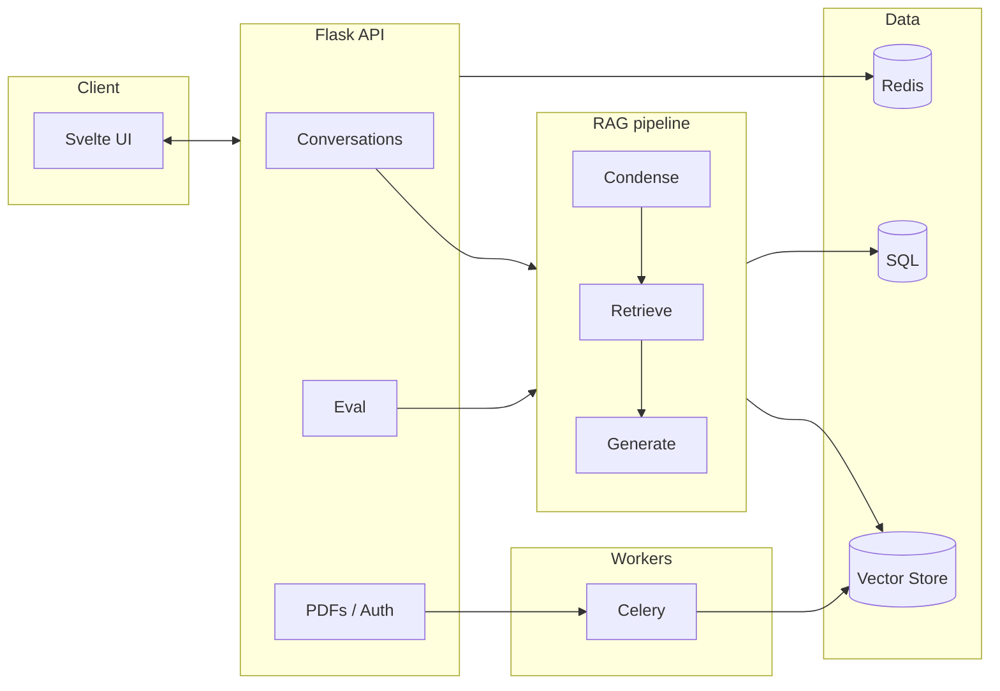
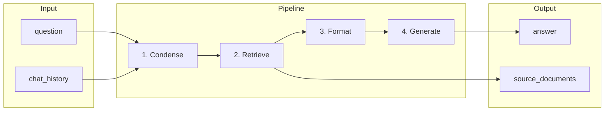

# ChatPDF | Production RAG System — Conversational AI with Evaluation, Observability and SSE Streaming

[](https://www.python.org/downloads/)
[](https://langchain.com/)
[](https://opensource.org/licenses/MIT)

**A production-grade Retrieval-Augmented Generation (RAG) system** with multi-turn conversational QA, automated evaluation (retrieval + LLM-as-judge), full-chain observability, and pluggable LLM/retriever backends. Built to demonstrate end-to-end LLM engineering: from document ingestion and vector search to answer generation, streaming, and measurable quality.

---

## Why This Project Matters

This repo showcases **LLM / RAG engineering at production level**: not a toy demo, but a system with **conversational context**, **evaluation pipelines**, **observability**, and **operational patterns** (async workers, caching, multi-provider support) that mirror what you’d run in a real product or platform team.

---

## What’s Inside — LLM Engineering Highlights

| Area | What’s Implemented |
|------|--------------------|
| **RAG pipeline** | LCEL-based conversational RAG: question condensation → retrieval → context formatting → generation. Custom `StreamingConversationalRAGChain` with `invoke()` and token-level `stream()`. |
| **Conversation** | SQL-backed chat history (`SqlMessageHistory`), `RunnableWithMessageHistory` integration, follow-up question condensation so “How does it work?” is resolved using prior turns. |
| **Retrieval** | Vector search (Pinecone; ChromaDB-ready), configurable `k`, metadata filtering by `pdf_id`, same embedding model for index and eval. |
| **Evaluation** | **Retrieval:** context relevance (embedding similarity). **Generation:** faithfulness & answer relevance via **LLM-as-judge** (GPT-4o-mini / Llama 3.2). **Performance:** retrieval/generation/total latency. Dataset runner with mean/std aggregation and optional sampling from recent traffic. |
| **Observability** | Langfuse tracing: conversation-level traces, session/user metadata, chain steps (condense, retrieve, generate) for debugging and cost/latency analysis. |
| **Orchestration** | Multi-provider LLM support (OpenAI, Ollama for condensation). Pluggable retriever/LLM selection with **score-based component selection** (Redis-backed user feedback → weighted random choice). |
| **Production** | Async PDF processing (Celery), Redis cache, Flask API, SSE streaming, Svelte frontend, auth, and structured eval API. |

---

## Architecture

### System overview



### RAG pipeline (per message)



| Step | In | Out |
|------|----|-----|
| **Condense** | question + chat_history | standalone question |
| **Retrieve** | standalone question | top-k chunks |
| **Format** | chunks | context string |
| **Generate** | context + question | answer (streamed) + source_documents |

---

## RAG flow (per request)

`question` + `chat_history` → **condense** to standalone question → **retrieve** top-k chunks → **format** context → **generate** answer (streaming). Output: `answer` + `source_documents`. Eval runs the same pipeline (no history) and computes context relevance, faithfulness, answer relevance, and latencies.

---

## Features in Detail

### 1. Conversational RAG (Context-Aware)

- **Question condensation:** Converts follow-ups (e.g. “How does it work?”) into standalone queries using chat history so retrieval stays on-topic.
- **Persistent history:** `SqlMessageHistory` + `RunnableWithMessageHistory`; messages stored in SQL and loaded per conversation.
- **Streaming:** Token-level streaming for the final answer; condense + retrieve run once, then QA chain streams tokens over SSE.

#### Token streaming: from LLM to frontend

Tokens flow in one direction from the QA LLM to the UI. Here’s the path with the relevant code:

| Step | Where | What happens |
|------|--------|--------------|
| **1. LLM emits tokens** | `app/chat/llms/chatopenai.py` | QA LLM is built with `disable_streaming=not chat_args.streaming`. When the API calls with `stream=True`, the LLM (e.g. `ChatOllama`) streams tokens from the model. |
| **2. Chain yields chunks** | `app/chat/chains/conversational_rag.py` | `StreamingConversationalRAGChain.stream()` runs condense + retrieve once, then `for chunk in self.qa_chain.stream(qa_input, ...): yield {"answer": chunk}`. Each LLM token is a `chunk`; `StrOutputParser` turns LLM stream into string chunks. |
| **3. API sends SSE** | `app/web/views/conversation_views.py` | For `?stream=true`, the view iterates `for chunk in chat.stream(...)`, gets `text = chunk.get("answer", "")`, and `yield text`. Response is `stream_with_context(generate()), mimetype="text/event-stream"` — each yielded string is sent as SSE body. |
| **4. Frontend appends to message** | `client/src/store/chat/stream.ts` | `fetch(..., ?stream=true)` then `response.body.getReader()`. Loop: `reader.read()` → `TextDecoder().decode(value)` → `_appendResponse(responseMessage.id, text)` updates the assistant message in the store so the UI shows tokens as they arrive. |

End-to-end: **LLM stream → `qa_chain.stream()` → view generator yields text → SSE → fetch stream → `reader.read()` → decode → append to message content.**

### 2. Evaluation Framework

- **Context relevance (0–1):** Cosine similarity between question embedding and each retrieved chunk; averaged. Measures retrieval quality without labels.
- **Faithfulness (0–1):** LLM-as-judge: “Is the answer fully supported by the context?” — reduces hallucination risk.
- **Answer relevance (0–1):** LLM-as-judge: “Does the answer address the question?”
- **Latency:** Retrieval, generation, and total (with optional per-step instrumentation).
- **Runner:** `evaluate_single_run()` for one Q&A; `run_eval_dataset()` for many questions with summary (mean/std) and debug info (e.g. `n_source_documents`).
- **API:** `POST /api/eval/run` with `pdf_id` and either `questions` or `max_samples` (sample recent human messages). See [app/chat/eval/README.md](app/chat/eval/README.md) and [EVAL_STRATEGY.md](app/chat/eval/EVAL_STRATEGY.md).

### 3. Observability (Langfuse)

- Trace per conversation with `session_id`, `user_id`, metadata.
- LangChain callback handler so condense, retrieval, and generation show up as steps.
- Enables debugging (inputs/outputs, retrieved docs), cost and latency analysis, and monitoring.

### 4. Pluggable Components & Score-Based Selection

- **LLMs:** e.g. GPT-4, GPT-3.5-turbo (extensible to Anthropic, Ollama, Groq, etc.).
- **Retrievers:** e.g. Pinecone with k=1, 2, 3 (or ChromaDB); selected per conversation.
- **Score-based selection:** User feedback (thumbs up/down) stored in Redis; next conversation uses weighted random choice over LLM/retriever/memory by average score — simple bandit-style component selection.

### 5. Production-Ready Stack

- **Backend:** Flask, SQLAlchemy, Celery, Redis.
- **Document pipeline:** PDF upload → Celery task → extract text → chunk (e.g. RecursiveCharacterTextSplitter) → embed → upsert to vector store.
- **Auth:** Session-based; row-level isolation (users see only their PDFs/conversations).

---

## Tech Stack

| Layer | Technologies |
|-------|--------------|
| **Backend** | Flask 3, SQLAlchemy 2, Celery 5, Redis 7 |
| **LLM / RAG** | LangChain 1, LangGraph, LangChain OpenAI, LangChain Ollama, LangChain Pinecone |
| **Vector DB** | Pinecone (primary), ChromaDB (supported) |
| **Embeddings** | OpenAI (default), configurable |
| **Observability** | Langfuse |
| **Frontend** | SvelteKit, TypeScript, Tailwind, PDF.js |
| **Eval** | Custom metrics (embedding similarity, LLM-as-judge) |

---

## Quick Start

**Prerequisites:** Python 3.11+, Node 18+, Redis, and (optional) Ollama for local judge/condenser.

```bash
git clone <repo-url>
cd pdf
python -m venv .venv
source .venv/bin/activate   # or .venv\Scripts\activate on Windows
pip install -r requirements.txt
cp .env.example .env       # set SECRET_KEY, DB, Redis, OpenAI, Pinecone, Langfuse
flask --app app.web init-db
```

**Run (3 processes):**

```bash
# Terminal 1
inv dev                    # Flask API @ http://localhost:8000

# Terminal 2
inv devworker              # Celery worker (PDF processing)

# Terminal 3
redis-server
```

**Optional frontend:**

```bash
cd client && npm install && npm run dev   # http://localhost:5173
```

**Example: run evaluation via API**

```bash
curl -X POST http://localhost:8000/api/eval/run \
  -H "Content-Type: application/json" \
  -d '{"pdf_id": 1, "questions": ["What is the main topic?", "Summarize section 2."]}' \
  --cookie "session=<your-session-cookie>"
```

---

## Project Structure

```
app/
├── chat/                        # RAG & LLM core
│   ├── chains/
│   │   └── conversational_rag.py # LCEL chain: condense → retrieve → QA (invoke + stream)
│   ├── eval/
│   │   ├── metrics.py            # context_relevance, faithfulness, answer_relevance
│   │   ├── runner.py             # evaluate_single_run, run_eval_dataset
│   │   ├── prompts.py            # LLM-as-judge prompts
│   │   ├── README.md             # Eval API & usage
│   │   └── EVAL_STRATEGY.md      # Metric definitions & interpretation
│   ├── embeddings/               # Embedding client (e.g. OpenAI)
│   ├── llms/                     # LLM builders (OpenAI, etc.)
│   ├── memories/histories/
│   │   └── sql_history.py        # SqlMessageHistory for conversation
│   ├── tracing/langfuse.py       # Langfuse client & trace setup
│   ├── vector_stores/            # Pinecone (and Chroma) retriever builders
│   ├── score.py                  # Redis-backed component scoring
│   └── chat.py                   # build_chat, build_chat_base (for eval)
├── celery/                       # Celery app & PDF tasks
└── web/                          # Flask app, DB models, API views (auth, PDFs, conversations, eval)
```

See [ARCHITECTURE.md](ARCHITECTURE.md) for detailed design, chunking, and deployment notes.

---

## Documentation

- [ARCHITECTURE.md](ARCHITECTURE.md) — System design, RAG steps, memory, vector store, Celery, Langfuse, DB schema, API.
- [app/chat/eval/README.md](app/chat/eval/README.md) — Eval API and Python usage.
- [app/chat/eval/EVAL_STRATEGY.md](app/chat/eval/EVAL_STRATEGY.md) — What each metric measures, how it’s computed, and how to interpret results.

---

## Contributing


### 🎯 Contribution Areas

1. **Hybrid Search Implementation**
   - Add BM25 keyword search
   - Implement Reciprocal Rank Fusion
   - Benchmark against semantic-only search

2. **Re-ranking**
   - Integrate cross-encoder re-ranker
   - Add re-ranking evaluation metrics

3. **Testing**
   - Unit tests for RAG chains
   - Integration tests for API endpoints
   - End-to-end tests for user flows

4. **Performance Optimization**
   - Query result caching
   - Embedding caching
   - Batch processing for embeddings

5. **Monitoring**
   - Prometheus metrics
   - Grafana dashboards
   - Alert rules

6. **Deployment**
   - Docker Compose setup
   - Kubernetes manifests
   - CI/CD pipeline

---


## License

MIT. See [LICENSE](LICENSE) if present.

---

**Built with LangChain, Flask, Pinecone, Langfuse, and Svelte**
